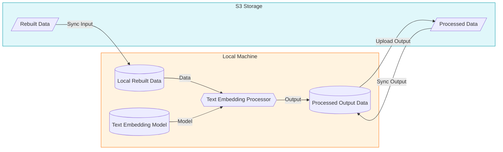

# Impresso Multilingual Text Embedder

This repository offers tools for embedding texts in multiple languages with an efficient workflow. It uses the `transformers` library by Hugging Face and the `make` tool to manage large datasets. `Make` ensures robust and incremental processing, allowing you to handle new data, resume tasks, and run processes across different machines, all while avoiding redundant work.

## Features

- **Efficient Storage Management:** Minimal local storage is required as necessary data for each year of a newspaper are downloaded on-the-fly and truncated after uploading.
- **Parallel Processing:** Processes run in parallel to optimize throughput.
- **Selective Processing:** Only the necessary processing steps are executed, ensuring efficiency by not reprocessing existing outputs on S3.
- **S3 Integration:** Integration with S3 for storing and resuming processing. The
  system ensures no overwriting of files or partial uploads due to interruptions. It is
  also posssible to run everything locally without S3.
- **Custom Embedding Options:** Flexible configurations via normal environment variables or make variables, including the ability to specify model versions and filter text data.

### Missing Features

- Batch processing of texts is not yet implemented. This will be added in a future
  release.
- Installing specialized xformer implementation for sparse attention inference is not yet
  imlemented. This shoulld be added in a future release for faster inference.

## Concepts

### Storage Locations

- **Local Storage:** Temporary disk space used for processing tasks. This disk space can
  be fast storage.
- **S3 Storage:** Permanent storage where final results are stored. Processing can be resumed from this storage.

### File Stamps

To manage dependencies, local file stamps are used:

- **Input Stamps (`.stamp`):** Indicate the status of input files on S3.
- **Output Stamps (no extension or `.done`):** Indicate the completion status of output
  files on S3. Make uses these to determine if a file needs to be processed or not.

Local stamps help `make` determine which files need to be processed or skipped. The helper script `lib/sync_s3_filestamps.py` manages these stamps by syncing them with S3.

### File Organization

The processing follows a structured organization:

- **S3 Buckets:** Data is organized by processing steps and, in some cases, versions.
- **Build Directory:** A local mirror of the S3 storage, structured similarly for consistency.

```plaintext
# Example directory structure
BUILD_DIR/BUCKET/NEWSPAPER/<NEWSPAPER-YEAR>.jsonl.bz2
BUILD_DIR/BUCKET/PROCESSING_TYPE/VERSION/NEWSPAPER/<NEWSPAPER-YEAR>.jsonl.bz2
```

## Setup

1. **Clone the Repository:**

   ```bash
   git clone git@github.com:impresso/impresso-text-embedder.git
   cd impresso-text-embedder
   ```

2. **Configure S3 Credentials:**
   Copy the `dotenv.sample` file to `.env`. Modify the `.env` file to include your AWS credentials:

   ```plaintext
   SE_ACCESS_KEY=<your-access-key>
   SE_SECRET_KEY=<your-secret-key>
   SE_HOST_URL=<your host name>
   ```

3. **Install Dependencies:**
   Ensure `make` and `python3` and `pip3` are installed. For GPU support of pytorch, go to
   https://pytorch.org/get-started/locally/ and get your installation command. Run:

   ```bash
   pip3 install torch torchvision torchaudio --index-url https://download.pytorch.org/whl/cu124
   pip3 install -r requirements.txt

   # or pipenv install
   ```

4. **Setup Environment and make variables**:

   ```bash
   cp dotenv.sample .env  # edit .env with your S3 credentials
   cp local.config.sample.mk local.config.mk  # edit local.config.mk with your local settings
   ```

5. **Setup Directories and Model:**
   Create necessary directories, the list of newspapers to process and download the Hugging Face model:
   ```bash
   make setup
   ```

## Usage

### Makefile Targets

```bash
make help
```

### Running the Embedder

1. **Process a single newspaper:**
   You can specify a list of newspapers to process using the `NEWSPAPER_LIST_FILE`. The default list is generated automatically from the S3 bucket:

   ```bash
   make newspaper
   ```

2. **Parallel Processing of each newspaper:**
   To process newspapers in parallel, use:

   ```bash
   make each
   ```

## Data flow overview:



## About

### Impresso

[Impresso - Media Monitoring of the Past](https://impresso-project.ch) is an
interdisciplinary research project that aims to develop and consolidate tools for
processing and exploring large collections of media archives across modalities, time,
languages and national borders. The first project (2017-2021) was funded by the Swiss
National Science Foundation under grant
No. [CRSII5_173719](http://p3.snf.ch/project-173719) and the second project (2023-2027)
by the SNSF under grant No. [CRSII5_213585](https://data.snf.ch/grants/grant/213585))
and the Luxembourg National Research Fund under grant No. 17498891.

### Copyrights

Copyright (C) 2018-2024 The Impresso team.  
Contributors to this program include: [Simon Clematide](https://github.com/simon-clematide)

### License

This program is provided as open source under
the [GNU Affero General Public License](https://github.com/impresso/impresso-pyindexation/blob/master/LICENSE)
v3 or later.

---

<p align="center">
  
</p>
