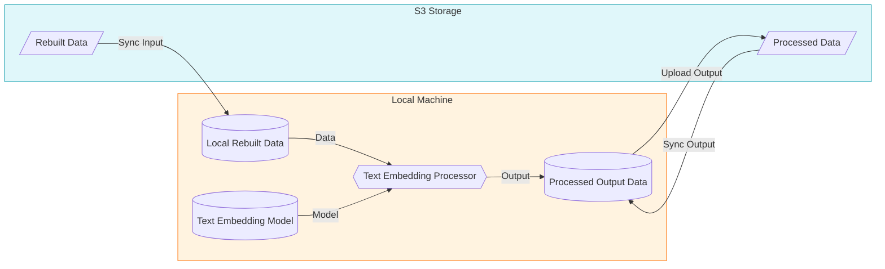

# Impresso Multilingual Text Embedder

This repository offers tools for embedding texts in multiple languages with an efficient workflow. It uses the
`transformers` library by Hugging Face and the `make` tool to manage large datasets. `Make` ensures robust and
incremental processing, allowing you to handle new data, resume tasks, and run processes across different machines, all
while avoiding redundant work.

The embedder supports:

- **Text-level embeddings** (full page / full article)
- **Sentence-level embeddings**
- **Chunk-level embeddings**

`make` ensures reliable, incremental, and resumable processing across machines and environments. All outputs can be
uploaded safely to S3 or kept locally.

---

## Features

- **Efficient Storage Management:** Minimal local storage is required as necessary data for each year of a newspaper are
  downloaded on-the-fly and truncated after uploading.
- **Parallel Processing:** Processes run in parallel to optimize throughput.
- **Selective Processing:** Only the necessary processing steps are executed, ensuring efficiency by not reprocessing
  existing outputs on S3.
- **S3 Integration:** Integration with S3 for storing and resuming processing. The
  system ensures no overwriting of files or partial uploads due to interruptions. It is
  also possible to run everything locally without S3.
- **Custom Embedding Options:** Flexible configurations via normal environment variables or make variables, including
  the ability to specify model versions and filter text data.

---

# Missing Features (Upcoming)

- Batch processing of texts is not yet implemented. This will be added in a future
  release.
- Installing specialized xformer implementation for sparse attention inference is not yet
  implemented. This should be added in a future release for faster inference.
-

---

# Concepts

## Storage Layout

### Local Storage

Temporary workspace used to mirror S3 structure.

### S3 Storage

Permanent storage for processed embeddings (optional).

```
s3://$OUT_S3_BUCKET_PROCESSED_DATA/textembeddings-<MODEL>-<VERSION>/<PROVIDER>/<NEWSPAPER>/<NEWSPAPER-YEAR>.jsonl.bz2
```

## File Stamps

`make` uses local stamp files to track progress:

- **`.stamp` files** indicate S3 input availability
- **`.done` files** indicate processed outputs

A helper script `lib/sync_s3_filestamps.py` keeps stamps synced with S3.

---

### File Organization

The processing follows a structured organization:

- **S3 Buckets:** Data is organized by processing steps and, in some cases, versions.
- **Build Directory:** A local mirror of the S3 storage, structured similarly for consistency.

```plaintext
# Example directory structure
BUILD_DIR/BUCKET/PROVIDER/NEWSPAPER/<NEWSPAPER-YEAR>.jsonl.bz2
BUILD_DIR/BUCKET/PROCESSING_TYPE-VERSION/PROVIDER/NEWSPAPER/<NEWSPAPER-YEAR>.jsonl.bz2
```

Example

```
BUILD_DIR/
  # input bucket
  000-processing-test-samples/
    lingproc/lingproc-test-v1.0.0/
      SNL/
        EXP/
          EXP-1912.jsonl.bz2
  # output bucket
  140-processed-data-sandbox/
    textembeddings-gte-multilingual-base-v1.0.1/
        SNL/
          EXP/
            EXP-1912.jsonl.bz2
```

---

# Setup

## 1. Clone the Repository

```bash
git clone git@github.com:impresso/impresso-text-embedder.git
cd impresso-text-embedder
```

## 2. Configure S3 Credentials

```bash
cp dotenv.sample .env
```

Edit `.env`:

```
SE_ACCESS_KEY=<your-access-key>
SE_SECRET_KEY=<your-secret-key>
SE_HOST_URL=<host>
```

## 3. Install Dependencies

```bash
pip3 install torch torchvision torchaudio --index-url https://download.pytorch.org/whl/cu124
pip3 install -r requirements.txt
```

## 4. Setup Local Configuration

```bash
cp local.config.sample.mk config.local.mk
```

You must now edit `config.local.mk` (full guide below).

## 5. Create Directories & Download Model

```bash
make setup
```

---

# Running the Embedder

```
make newspaper     # process according to list in NEWSPAPER_LIST_FILE
make each          # process all newspapers in parallel
make help          # list all targets
```

---

# Embedding Modes

Set the embedding mode in `config.local.mk`:

```makefile
EMBEDDING_LEVEL_OPTION := sentence
# or: text, chunk
```

## 1. Text-Level Embedding

Embeds each full text object (page/article).

- Fastest mode.
- Best for document retrieval.
- No segmentation but texts below `EMBEDDING_MIN_CHAR_LENGTH` could be skipped.

## 2. Sentence-Level Embedding

Embeds each sentence individually.

- Uses a multilingual sentence segmenter.
- Short sentences (< `EMBEDDING_MIN_CHAR_LENGTH`) could be skipped.
- Best for search, QA, and fine-grained retrieval.

## 3. Chunk-Level Embedding

Embeds long texts split into fixed-size chunks.

- Prevents losing context when texts exceed model max length.
- Produces stable embeddings for long documents.

---

# Configuration Guide (`config.local.mk`)

Below is an example config file you **must** customize:

```makefile
# config.local.mk (example)

$(info Make: Including config.local.mk: $(shell readlink -f config.local.mk))

BUILD_DIR := build.d

# Model
CREATOR_NAME := Alibaba-NLP
HF_MODEL_NAME := gte-multilingual-base
HF_MODEL_VERSION := f7d567e
HF_FULL_MODEL_NAME := $(CREATOR_NAME)/$(HF_MODEL_NAME)

# Embedding level: text | sentence | chunk
EMBEDDING_LEVEL_OPTION := chunk

# Storage (input)
IN_S3_PREFIXES := lingproc/lingproc-test-v1.0.0
IN_S3_BUCKET_REBUILT := 000-processing-test-samples

# Storage (output)
OUT_S3_BUCKET_PROCESSED_DATA := 140-processed-data-sandbox
OUT_S3_PROCESSED_INFIX := textembeddings-$(HF_MODEL_NAME)
OUT_S3_PROCESSED_VERSION := v1.0.1

# Text filtering
EMBEDDING_MIN_CHAR_LENGTH := 10

# Local model cache
HF_HOME := ./hf.d

# Parallel processing
MAKE_PARALLEL_OPTION := --jobs 2

# Optional: Filter newspapers
PROVIDER  := SNL
NEWSPAPER := EXP

# Logging
LOGGING_LEVEL := WARNING
```

---

# Data Flow Overview


```mermaid
flowchart LR

    subgraph cluster_local ["Local Machine"]
        style cluster_local fill:#FFF3E0,stroke:#FF6F00,stroke-width:1px

        F{{"Text Embedding Processor"}}
        B[("Local Rebuilt Data")]
        E[("Text Embedding Model")]
        C[("Processed Output Data")]

    end

    subgraph cluster_s3 ["S3 Storage"]
        style cluster_s3 fill:#E0F7FA,stroke:#0097A7,stroke-width:1px

        A[/"Rebuilt Data"/]
        D[/"Processed Data"/]

        A -->|Sync Input| B
        B -->|Data| F
        E -->|Model| F
        F -->|Output| C
        C -->|Upload Output| D
        D -->|Sync Output| C
    end
```

---

## About

### Impresso

[Impresso - Media Monitoring of the Past](https://impresso-project.ch) is an
interdisciplinary research project that aims to develop and consolidate tools for
processing and exploring large collections of media archives across modalities, time,
languages and national borders. The first project (2017-2021) was funded by the Swiss
National Science Foundation under grant
No. [CRSII5_173719](http://p3.snf.ch/project-173719) and the second project (2023-2027)
by the SNSF under grant No. [CRSII5_213585](https://data.snf.ch/grants/grant/213585))
and the Luxembourg National Research Fund under grant No. 17498891.

### Copyrights

Copyright (C) 2018-2024 The Impresso team.  
Contributors to this program include: [Simon Clematide](https://github.com/simon-clematide)

### License

This program is provided as open source under
the [GNU Affero General Public License](https://github.com/impresso/impresso-pyindexation/blob/master/LICENSE)
v3 or later.

---

<p align="center">
  
</p>